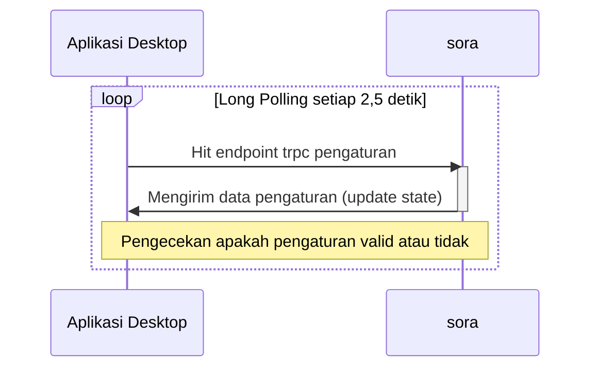

   
   <h1 align="center">Memahami Keseluruhan Arsitektur Aplikasi</h1>
   
    

File ini adalah penjelasan bagaimana keseluruhan aplikasi ini bekerja. Terdapat penjelasan yang disertakan diagram.

## Arsitektur Backend

Untuk backend, terdapat [sora](./apps/sora/) dan [vote-processor](./apps/vote-processor/) yang nantinya akan berkomunikasi dengan RabbitMQ dan database yang bertipe SQL.

Sora adalah aplikasi [Next.js](https://nextjs.org/) yang menggunakan [trpc](https://trpc.io/) untuk menjembatani frontend dan backend. Data seluruh kandidat, peserta pemilihan, dan pengaturan berada di sini. Aplikasi desktop akan berkomunikasi dengan metode Long Polling melalui endpoint trpc. Jika ada upvote yang masuk, akan diteruskan ke RabbitMQ untuk diproses.

RabbitMQ digunakan sebagai message broker untuk memproses data upvote. Setelah RabbitMQ mendapatkan data dari sora, saatnya vote-processor yang memproses upvote yang masuk. Processor hanya mengolah **satu** perintah voting yang masuk, hal ini dapat meminimalisir terjadinya data ganda. Di vote-processor ini akan menambah jumlah yang memilih kandidat dan status peserta akan diperbarui menjadi sudah memilih.

## Arsitektur Desktop

### Aplikasi Absensi

Aplikasi absensi ini di belakang layar mengambil data waktu mulai, waktu selesai, dan apakah sudah bisa absen atau belum. Jika kriteria itu memenuhi maka yang memiliki QR Code bisa absen.

Jika pengaturan valid maka aplikasi ini akan memunculkan halaman untuk scan QR Code yang ditunjukan oleh pemilih, jika tidak akan di tunjukan box dengan tulisan "Tidak Bisa Memilih!". Berikut ini diagramnya.

Jika QR menunjukan error dari QR yang tidak valid atau peserta pemilih sudah absen maka tidak bisa hilang secara otomatis. Perlu melakukan refresh browser untuk menghilangkan error tersebut dan kembali ke alur paling awal.
