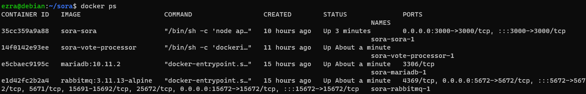
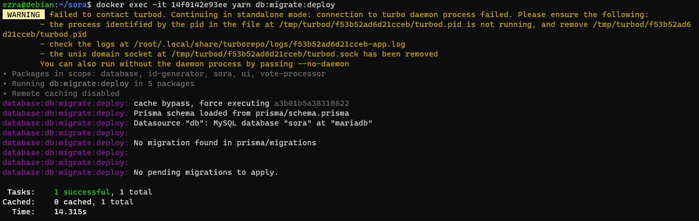
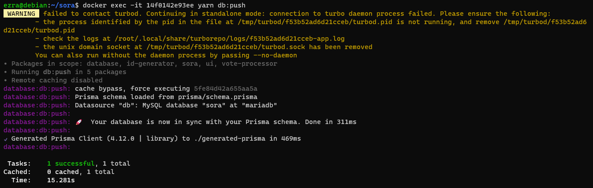

<p align="center">
   
   <h2 align="center">SORA</h2>
</p>

ᮞᮧᮛ (Sora) yang berarti suara adalah aplikasi yang dapat menyuarakan aspirasi masyarakat untuk memilih kandidat pemimpin yang baru.

Project ini adalah hasil rebuild [NVA13](https://github.com/sekilas13/nva13) yang awalnya dibuat dengan [Node.js](https://nodejs.org/en/) dengan templating engine [EJS](https://ejs.co/) digantikan dengan [Next.js](https://nextjs.org/) yang lebih modular. Tujuan utama dari aplikasi ini untuk mengurangi biaya karena penggunaan kertas dan juga waktu penghitungan yang manual.

#### Sebelum beranjak lebih jauh

Ini adalah branch untuk sora versi 2. Jika ingin menggunakan versi pertama, silahkan menuju ke branch [v1](https://github.com/reacto11mecha/sora/tree/v1) jika ingin menggunakan versi awal.

# Perbedaan dengan versi sebelumnya

Secara ringkas, berikut ini perbedaan dengan versi yang pertama.

- Repositori ini menggunakan sistem monorepo walaupun ada project yang berbeda repositori.
- Terdapat sistem absensi [kode QR](https://id.wikipedia.org/wiki/Kode_QR) yang menggantikan tanda tangan, tetapi masih bersifat anonim untuk menjaga asas [LUBER JURDIL](https://id.wikipedia.org/wiki/Pemilihan_umum_di_Indonesia).
- Terdapat consumer RabbitMQ yang dapat mencegah data ganda yang bernama [`vote-processor`](./apps/vote-processor/).
- Memisahkan bagian server dengan pemilih maupun kehadiran dengan aplikasi desktop.

Beberapa repositori yang dimaksud mencakup repositori dibawah ini.

- [sora-qrcode-web](https://github.com/reacto11mecha/sora-qrcode-web), repositori yang akan menghasilkan gambar kode QR yang bisa diunduh oleh partisipan.
- [sora-button-module](https://github.com/reacto11mecha/sora-button-module), modul tombol yang bisa dibuat sendiri jika tidak ingin menggunakan mouse.

## Konfigurasi Komputer Panitia

#### Prerequisites

Setidaknya terdapat instalasi ini untuk kedepannya menjalankan repositori pendukung dan task kecil.

- Node.js setidaknya versi 18.15.0 atau LTS, kunjungi https://nodejs.org/en
- npm (sudah bawaan Node.js) atau pnpm (kunjungi https://pnpm.io/installation)

### Cloning Dari Github

Jalankan perintah ini Command Line. Langkah ini adalah langkah awal yang berlaku untuk cara manual maupun docker.

```sh
# HTTPS
git clone https://github.com/reacto11mecha/sora.git

# SSH
git clone git@github.com:reacto11mecha/sora.git
```

Setelah mengkloning repositori dari github ke mesin lokal, terdapat dua pilihan untuk menjalankan aplikasi ini. Pilih salah satu dari opsi yang ada di bawah ini

<details>
   <summary>
      Menggunakan Docker
   </summary>

### Copy file [`.env.docker.example`](./.env.docker.example) ke `.env`

Salin file tersebut dan ubah sesuai isinya, berikut ini adalah keterangan dari masing-masing key yang ada.

Field yang wajib di isi.

- `NEXTAUTH_SECRET`: Secret yang digunakan oleh NextAuth untuk autentikasi
- `SETTINGS_SECRET`: Secret token yang akan mengencrypt file pengaturan agar tidak mudah diubah-ubah
- `DATABASE_PASSWORD`: Secret yang akan mengatur password database agar bisa di akses oleh sora dan vote-processor.

Untuk mengenerate secret `NEXTAUTH_SECRET` dan `SETTINGS_SECRET` bisa menggunakan snippet dibawah ini, jalankan di CLI dan gunakan hasilnya.

> ⚠️ **Token harus berbeda satu sama lain!** Jadi harus dijalankan dua kali.

```sh
# Menggunakan Base64
node -e 'console.log(require("crypto").randomBytes(50).toString("base64"));'

# Atau menggunakan hex
node -e 'console.log(require("crypto").randomBytes(50).toString("hex"));'
```

Opsional untuk diisi.

- `DATABASE_NAME`: Jika ingin menggunakan nama database yang lain bisa mengubah field ini. Default value `sora`.
- `TURBO_TOKEN`, `TURBO_TEAM`, `TURBO_API`: Field yang harus di isi ketika menggunakan fitur remote caching turborepo, kunjungi https://turbo.build/repo/docs/core-concepts/remote-caching

> Di rekomendasikan menggunakan fitur remote caching dikarenakan docker akan build sora dan vote-processor dari awal, bisa menggunakan [turborepo-remote-cache](https://github.com/ducktors/turborepo-remote-cache) di jalankan komputer sendiri/lain atau [Free Hosted Remote Cache](https://ducktors.github.io/turborepo-remote-cache/free-hosted-remote-cache) (baca baik-baik disclaimernya).

#### Menjalankan docker compose

Masuk ke direktori root dari sora dan jalankan perintah ini di terminal supaya aplikasi ini dapat berjalan.

```sh
docker compose up -d
```

#### Migrasi prisma

Docker mungkin sudah berjalan tetapi database masih kosong dan belum memiliki tabel, oleh karena itu perlu menjalankan migrasi. Berikut ini adalah langkah-langkah yang harus dilakukan.

1. Masuk vote-processor

   Cek terlebih dahulu dimana instance vote-processor berjalan dengan menggunakan `docker ps` dan akan muncul list seperti ini.

   

   Dalam contoh ini kita mengetahui bahwa vote-processor memiliki container id `14f0142e93ee`.

2. Jalankan migrasi

   Setelah mengetahui container id, jalankan perintah `yarn db:migrate:deploy` dan `yarn db:push`

   ```sh
   docker exec -it <CONTAINER_ID> yarn db:migrate:deploy
   docker exec -it <CONTAINER_ID> yarn db:push
   ```

   Kurang lebih hasilnya akan terlihat seperti ini.

   

   

### Mengakses Instance

Untuk mengakses instance ini, cek IP lokal yang di dapatkan mesin dan akses `http://<IP_MESIN>:3000/` lalu lakukan preparasi pemilihan.

</details>

<details>
   <summary>
      Cara Manual
   </summary>

#### Prerequisites

Jika menggunakan cara manual, berikut ini list yang diperlukan jika ingin menjalankan aplikasi ini.

- Node.js setidaknya versi 18.15.0 atau LTS, kunjungi https://nodejs.org/en
- Yarn versi 3.5.0 atau versi stable, kunjungi https://yarnpkg.com/getting-started/install
- Database MySQL atau sejenis seperti MariaDB versi 10.11.2, kunjungi https://mariadb.org/download
- RabbitMQ setidaknya versi 3.11.13, https://www.rabbitmq.com/download.html

#### Menginstall package dan [`pm2`](https://npm.im/pm2)

Anda ke root directory project dan menginstall package yang diperlukan.

```sh
yarn install
```

Kemudian install package [`pm2`](https://npm.im/pm2) secara global. Diharuskan untuk menggunakan `npm` atau `pnpm` dikarenakan yarn berry tidak support global package.

```sh
npm install -g pm2

# atau menggunakan pnpm
pnpm install -g pm2
```

#### Membuat prisma client

Diperlukan untuk menjalankan perintah ini untuk membuat typing prisma sebagai ORM yang menjalin koneksi ke database.

```sh
yarn generate
```

#### Menjalankan backend dan processor

Pertama-tama, copy file `.env.example` yang terdapat di masing-masing folder `apps/sora` dan `apps/vote-processor` ke file `.env` sesuai dengan folder asal.

Keterangan field yang ada:

- `AMQP_URL`: URL yang menghubungkan kedua aplikasi ke RabbitMQ
- `DATABASE_URL`: URL Database MySQL yang akan dijadikan penyimpanan data.
- `NEXTAUTH_SECRET`: Secret yang digunakan oleh NextAuth untuk autentikasi
- `NEXTAUTH_URL`: URL yang nantinya akan digunakan pada saat production. Biarkan saja valuenya seperti contoh.
- `SETTINGS_SECRET`: Secret token yang akan mengencrypt file pengaturan agar tidak mudah diubah-ubah
- `TRPC_URL`: URL endpoint dimana `vote-processor` dapat terhubung ke `sora`, biarkan default jika berjalan di komputer yang sama.

Untuk mengenerate secret `NEXTAUTH_SECRET` dan `SETTINGS_SECRET` bisa menggunakan snippet dibawah ini, jalankan di CLI dan gunakan hasilnya.

> ⚠️ **Token harus berbeda satu sama lain!** Jadi harus dijalankan dua kali.

```sh
# Menggunakan Base64
node -e 'console.log(require("crypto").randomBytes(50).toString("base64"));'

# Atau menggunakan hex
node -e 'console.log(require("crypto").randomBytes(50).toString("hex"));'
```

Sebelum menjalankan, terlebih dahulu membuild sora dan vote-processor supaya bisa dijalankan di production mode.

```sh
yarn build
```

Setelah selesai, jalankan sora dan vote-processor menggunakan pm2.

> ⚠️ Jangan lupa untuk memastikan database dan RabbitMQ sudah berjalan.

```sh
pm2 start ecosystem.config.js
```

#### Menjalankan migrasi

Database mungkin sudah berjalan tapi belum memiliki tabel, oleh karena itu diperlukan migrasi dari prisma untuk membuat tabel. Jalankan perintah dibawah ini untuk membuat tabel.

```sh
yarn db:migrate:deploy
yarn db:push
```

</details>
