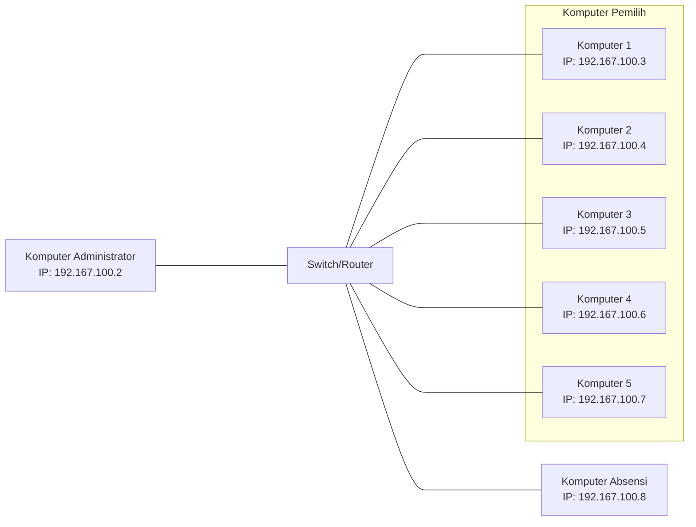
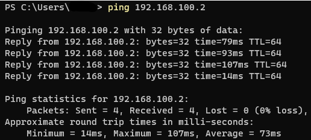

<p align="center">
   
   <h1 align="center">SORA</h1>
   
   [](https://github.com/reacto11mecha/sora/actions/workflows/ci.yml) [](https://github.com/reacto11mecha/sora/actions/workflows/codeql.yml)
</p>

ᮞᮧᮛ (Sora) yang berarti suara adalah aplikasi yang dapat menyuarakan aspirasi masyarakat untuk memilih kandidat pemimpin yang baru.

Project ini adalah hasil rebuild [NVA13](https://github.com/sekilas13/nva13) yang awalnya dibuat dengan [Node.js](https://nodejs.org/en/) dengan templating engine [EJS](https://ejs.co/) digantikan dengan [Next.js](https://nextjs.org/) yang lebih modular. Tujuan utama dari aplikasi ini untuk mengurangi biaya karena penggunaan kertas dan juga waktu penghitungan yang manual.

#### Sebelum beranjak lebih jauh

Ini adalah branch untuk sora versi 2. Jika ingin menggunakan versi pertama, silahkan menuju ke branch [v1](https://github.com/reacto11mecha/sora/tree/v1) jika ingin menggunakan versi awal.

## Perbedaan dengan versi sebelumnya

Secara ringkas, berikut ini perbedaan dengan versi yang pertama.

- Repositori ini menggunakan sistem monorepo walaupun ada project yang berbeda repositori.
- Terdapat sistem absensi [kode QR](https://id.wikipedia.org/wiki/Kode_QR) yang menggantikan tanda tangan, tetapi masih bersifat anonim untuk menjaga asas [LUBER JURDIL](https://id.wikipedia.org/wiki/Pemilihan_umum_di_Indonesia).
- Terdapat consumer RabbitMQ yang dapat mencegah data ganda yang bernama [`processor`](./apps/processor/).
- Memisahkan bagian server dengan pemilih maupun kehadiran dengan aplikasi desktop.

Beberapa repositori yang dimaksud mencakup repositori dibawah ini.

- [sora-qrcode-web](https://github.com/reacto11mecha/sora-qrcode-web), repositori yang akan menghasilkan gambar kode QR yang bisa diunduh oleh partisipan.
- [sora-button-module](https://github.com/reacto11mecha/sora-button-module), modul tombol yang bisa dibuat sendiri jika tidak ingin menggunakan mouse.

## Fitur-fitur yang tersedia

1. Dashboard admin yang memiliki sistem login untuk mengelola berjalannya pemilihan.
2. Terdapat pengelola kandidat, peserta pemilihan, pengaturan kapan dan berhenti pemilihan, sudah bisa memilih atau absen, juga statistik pemilihan.
3. Fitur upload csv dan pembuat pdf juga export json untuk [sora-qrcode-web](https://github.com/reacto11mecha/sora-qrcode-web).
4. Peserta pemilihan harus menggunakan QR Code untuk menggunakan hak suara mereka, QR tersebut didapat dari panitia yang mengirimkan PDF yang berisikan list peserta.
5. Peserta yang ingin memilih terlebih dahulu absen masuk, setelah itu dia bisa memilih.
6. Aplikasi desktop untuk pemilih bisa menerima sinyal keyboard angka 1-5, Esc, dan Enter untuk memilih. Selain itu juga bisa menerima input dari custom keyboard buatan sendiri menggunakan [sora-button-module](https://github.com/reacto11mecha/sora-button-module).

## Konfigurasi Komputer Utama (Administrator)

### Prerequisites

Setidaknya terdapat instalasi ini untuk kedepannya menjalankan repositori pendukung dan task kecil.

- Node.js setidaknya versi 18.15.0 atau LTS, kunjungi https://nodejs.org/en
- npm (sudah bawaan Node.js) atau pnpm (kunjungi https://pnpm.io/installation)
- Yarn versi 3.5.0 atau versi stable, kunjungi https://yarnpkg.com/getting-started/install
- Database MySQL atau sejenis seperti MariaDB versi 10.11.2 ke atas, kunjungi https://mariadb.org/download
- RabbitMQ versi 3.11.13 ke atas, https://www.rabbitmq.com/download.html

### Cloning Dari Github

Jalankan perintah ini di command line.

```sh
# HTTPS
git clone https://github.com/reacto11mecha/sora.git

# SSH
git clone git@github.com:reacto11mecha/sora.git
```

### Menginstall package dan [`pm2`](https://npm.im/pm2)

Anda ke root directory project dan menginstall package yang diperlukan.

```sh
yarn install
```

Kemudian install package [`pm2`](https://npm.im/pm2) secara global. Diharuskan untuk menggunakan `npm` atau `pnpm` dikarenakan yarn berry tidak support global package.

```sh
npm install -g pm2

# atau menggunakan pnpm
pnpm install -g pm2
```

### Membuat prisma client

Diperlukan untuk menjalankan perintah ini untuk membuat typing prisma sebagai ORM yang menjalin koneksi ke database.

```sh
yarn db:generate
```

### Buat file

Pertama-tama, copy file [`.env.example`](.env.example) yang ada di root project ke `.env` yang letak filenya berada di root juga.

Keterangan field yang ada:

- `AMQP_URL`: URL yang menghubungkan kedua aplikasi ke RabbitMQ
- `DATABASE_URL`: URL Database MySQL yang akan dijadikan penyimpanan data.
- `NEXTAUTH_SECRET`: Secret yang digunakan oleh NextAuth untuk autentikasi
- `NEXTAUTH_URL`: URL yang nantinya akan digunakan pada saat production. Biarkan saja valuenya seperti contoh.
- `TRPC_URL`: URL endpoint dimana `processor` dapat terhubung ke `sora`, biarkan default jika berjalan di komputer yang sama.

Untuk mengenerate secret `NEXTAUTH_SECRET` bisa menggunakan snippet dibawah ini, jalankan di CLI dan gunakan hasilnya.

```sh
# Menggunakan Base64
node -e 'console.log(require("crypto").randomBytes(50).toString("base64"));'

# Atau menggunakan hex
node -e 'console.log(require("crypto").randomBytes(50).toString("hex"));'
```

### Menjalankan migrasi

Database mungkin sudah berjalan tapi belum memiliki tabel, oleh karena itu diperlukan migrasi dari prisma untuk membuat tabel. Jalankan perintah dibawah ini untuk membuat tabel.

> ⚠️ Jangan lupa untuk memastikan database sudah berjalan.

```sh
yarn db:push
```

### Menjalankan sora dan processor

Sebelum menjalankan, terlebih dahulu membuild sora dan processor supaya bisa dijalankan di production mode.

```sh
yarn build
```

Setelah selesai, jalankan sora dan processor menggunakan pm2.

> ⚠️ Jangan lupa untuk memastikan database dan RabbitMQ sudah berjalan. Pastikan db:push sudah berjalan dengan benar.

```sh
pm2 start ecosystem.config.js
```

## Konfigurasi semua komputer pemilih dan absensi

### Instalasi jaringan

Komputer pemilih dapat menggunakan laptop atau komputer yang dilengkapi dengan kamera bawaan atau menggunakan kamera eksternal apapun untuk membaca QR Code yang ditunjukkan oleh peserta. Untuk setiap pemilihan, dibutuhkan setidaknya 3 perangkat yaitu komputer administrator, komputer pemilih, dan komputer absensi. Jumlah komputer yang digunakan dapat menyesuaikan ketersediaan perangkat yang ada.

Untuk instalasi jaringan, dapat menggunakan Switch Hub atau Router WiFi. Disarankan menggunakan Switch Hub karena jaringan yang terhubung benar-benar terisolasi dari jaringan luar.

Namun, jika hanya tersedia Router WiFi, ada beberapa hal yang harus dilakukan untuk meningkatkan keamanan, yaitu:

1. Gunakan WPA2/WPA3 dengan password yang acak, tidak mudah ditebak, dan cukup panjang.
2. Matikan akses WPS, karena fitur ini dapat mempermudah penyerang untuk mendapatkan akses ke jaringan.
3. Gunakan daftar putih (whitelist) berdasarkan MAC address untuk membatasi akses ke jaringan hanya pada perangkat yang diizinkan.
4. Batasi jangkauan jaringan sesuai dengan kondisi lapangan, jika router WiFi memiliki fitur ini.

Jika dibuatkan diagram, instalasi jaringan akan terlihat seperti ini:



Kemudian cek konektivitas dari semua komputer pemilih dan komputer absensi, apakah berhasil terhubung atau tidak. Caranya tinggal menggunakan command `ping`.

Asumsikan komputer administrator berjalan pada IP `192.168.100.2`, berarti jalankan perintah dibawah ini.

```sh
ping 192.168.100.2
```

Jika berhasil, kurang lebih akan terlihat seperti ini.



### Instalasi kedua aplikasi desktop (pemilih dan absensi)

Silahkan pergi ke bagian [releases](https://github.com/reacto11mecha/sora/releases) dan pilih aplikasi desktop yang sesuai. Untuk absensi di awali dengan `absensi-desktop-` sedangkan `sora-desktop-` menandakan bahwa aplikasi tersebut adalah aplikasi pemilihan. Tersedia untuk os windows dan linux 64 bit.

> Karena belum ada codesigning, maka antivirus membaca aplikasi ini mengandung virus. Matikan antivirus jika ingin menggunakan aplikasi ini.

> Note di windows: TODO

### Setup pertama kali aplikasi desktop

TODO
